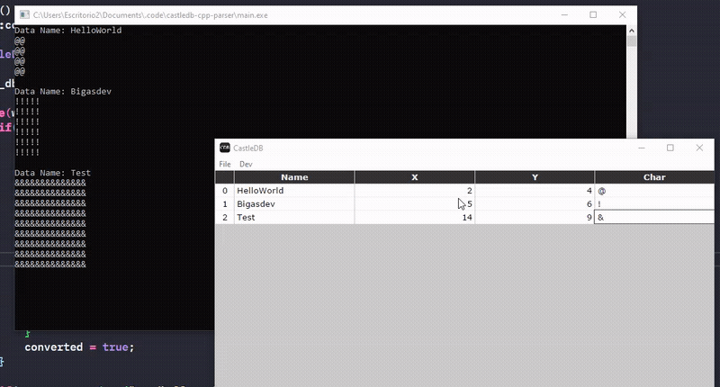

# CastleDB-cpp-parser

_Quickly parse your castle db to use in your cpp codebade, it supports Hot Reload!_


## Usage

Add the files inside the **.src/** folder to your codebase and call the constructor to grab the data with the CastleDBConverter class

```
CastleDBConverter converter("res/helloworld.json");
```

You can then extract your data, a nice feature is that you can grab only the fields you need

```
                                //sheet name   //fields
data_db = converter.extract_data("HelloWorld", {"Name", "X", "Y", "Char"});
```

You can use the update method to check for updates in the file for hot reload support
```
if(converter.update("res/helloworld.json")){
    //your code
}
```

## Thanks
Thanks for [ncannasse](https://github.com/ncannasse) for the creation of [CastleDB](https://github.com/ncannasse/castle) and to [nlohmann](https://github.com/nlohmann) for [json parser](https://github.com/nlohmann/json)